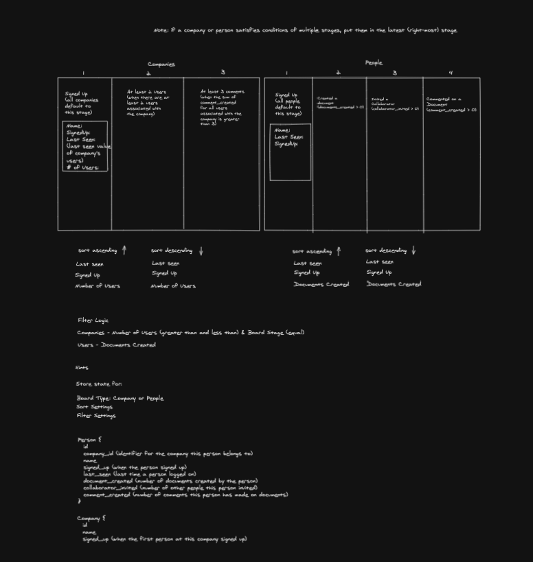

# HeadsUp Product Engineering Exercise 

This is based on a starter template for [Learn Next.js](https://nextjs.org/learn). You will need to learn and use [React](https://reactjs.org), [Next.js](https://nextjs.org/learn), and [Ant Design](https://ant.design/components/overview/).

1. First install dependencies: `yarn install`.
2. To start the dev server: `yarn run dev`.
3. Visit [http://localhost:3000](http://localhost:3000).

For exercise instructions, please email us.

Please add any notes to this file.

Notes from the exercise if I was given more time:
If I was given more time I would break out companies and people into separate files and useState to store the data.
Finish the rest of the requirements sorting the data for last seen, signed up and number of users
Add some more styling to make it look nice 

Here is my diagram: 

